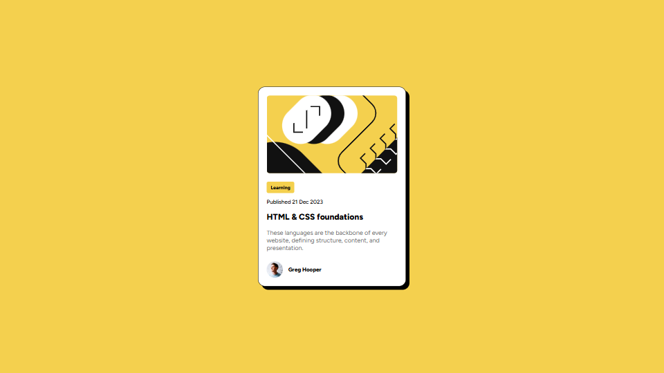

# Frontend Mentor - QR code component solution

Bu, Frontend Mentor'daki [Blog Önizleme Kartı](https://www.frontendmentor.io/challenges/blog-preview-card-ckPaj01IcS) meydan okumasının bir çözümüdür. Frontend Mentor meydan okumaları, gerçekçi projeler oluşturarak kodlama becerilerinizi geliştirmenize yardımcı olur.

## İçindekiler

- [Genel Bakış](#genel-bakış)
  - [Ekran Görüntüsü](#ekran-görüntüsü)
  - [Linkler](#linkler)
  - [Yazar](#yazar)
  - [Teşekkürler](#teşekkürler)

## Genel-Bakış

### Ekran-Görüntüsü

### Linkler

- Solution URL: [Add solution URL here](https://www.frontendmentor.io/challenges/blog-preview-card-ckPaj01IcS)
- Live Site URL: [Add live site URL here](https://jerklex.github.io/blog-preview-card-main/)

## Yazar

- Github - [jerklex](https://github.com/jerklex)
- Frontend Mentor - [@jerklex](https://www.frontendmentor.io/profile/jerklex)
- İnstagram - [@Webin.muhendisi](https://www.instagram.com/webin.muhendisi/)

## Teşekkürler

Bu projede size yardımcı olan kişilere teşekkür etmek için bu bölümü kullanabilirsiniz.